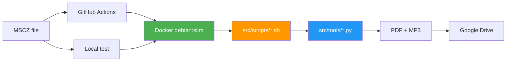

# MuseScore to Drive

> Template repository to automate MuseScore sheet conversion and upload to Google Drive

Automated GitHub Actions workflows to convert MuseScore (`.mscz`) files to PDF and MP3, then upload to Google Drive.

---

## Quick Start

**New here?** Follow the complete guide: [SETUP.md](src/docs/SETUP.md)

### Setup (10 minutes, zero local install):

1. Fork this repository
2. Create a Google Service Account → [Guide](src/docs/SETUP.md#create-google-service-account)
3. Configure GitHub secrets: `GCP_SERVICE_ACCOUNT_KEY_B64` + `DRIVE_FOLDER_ID`

Done! Add your `.mscz` files via GitHub interface (or git push) and CI handles the rest.

> Note: No Python, MuseScore or any local installation needed - everything runs in GitHub Actions.

---

## Features

- Automatic conversion: MSCZ → PDF + MP3
- Individual parts generation
- Organized Google Drive upload
- Docker optimized (debian:slim with pre-installed MuseScore)
- Local testing support
- Auto-update to latest MuseScore version

## Architecture

**Structure**:
- Root: `.mscz` files + config
- `src/`: All code (bash scripts, Python tools, docs)
- `src/scripts/`: Bash scripts (`.sh`)
- `src/tools/`: Python tools (`.py`)

## Tech Stack

- **CI/CD**: GitHub Actions
- **Container**: Docker (debian:bookworm-slim)
- **MuseScore**: Latest version (auto-detected via GitHub API)
- **Python**: google-api-python-client
- **Storage**: Google Drive API

## Performance

| Metric | Value |
|--------|-------|
| CI setup | ~5s (vs 70s before) |
| Docker image | 226 MB (vs 1.2 GB Ubuntu) |
| MuseScore update | Automatic (weekly) |
| Local testing | Supported |

## Workflows

| Workflow | Trigger | Description |
|----------|---------|-------------|
| **Update modified files** | Push `.mscz` to `main` | Process modified files |
| **Update all files** | Manual (`workflow_dispatch`) | Process all files |
| **Build Docker image** | Weekly / Manual | Rebuild Docker image |

## Utility Scripts

| Script | Description | Usage |
|--------|-------------|-------|
| `list_drive.sh` | Display Google Drive tree | `./src/scripts/list_drive.sh [folder_id]` |
| `process_musescore.sh` | Convert MSCZ to PDF/MP3 | `./src/scripts/process_musescore.sh *.mscz` |
| `upload_to_drive.sh` | Upload to Drive | `./src/scripts/upload_to_drive.sh` |

## Documentation

| Document | Description |
|----------|-------------|
| [Local Testing](src/docs/local-testing.md) | Guide for local testing with bash scripts |
| [Docker](src/docs/docker.md) | Docker architecture and optimizations |

## License

MIT
