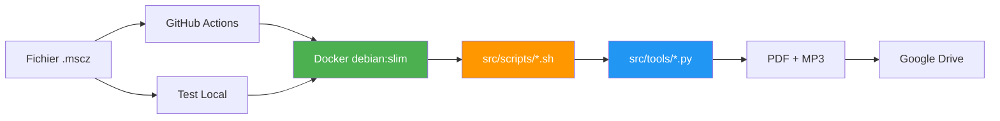

# 🎼 MuseScore to Drive

> **🎯 Template Repository** : Forkez ce projet pour automatiser la conversion et l'upload de vos partitions MuseScore vers Google Drive !

Workflows GitHub Actions automatisés pour convertir des fichiers MuseScore (`.mscz`) en PDF et MP3, puis les uploader vers Google Drive.

---

## 🚀 Démarrage rapide (pour les forkeurs)

**Nouveau ici ?** Suivez le guide complet : **[📖 SETUP.md](SETUP.md)**

### Setup en 3 étapes (10 minutes, 0 installation locale) :

1. **Forker ce repo**
2. **Créer un Service Account Google** → [Guide](SETUP.md#2️⃣-créer-un-service-account-google)
3. **Configurer les secrets GitHub** : `GCP_SERVICE_ACCOUNT_KEY_B64` + `DRIVE_FOLDER_ID`

**C'est tout !** Ajoutez vos fichiers `.mscz` via GitHub (ou git push) et le CI s'occupe du reste.

> 💡 **Pas besoin d'installer Python, MuseScore ou quoi que ce soit en local** - tout se passe dans GitHub Actions !

---

## ✨ Fonctionnalités

- 🎵 **Conversion automatique** : MSCZ → PDF + MP3
- 📄 **Parties individuelles** : Génération automatique des parties séparées
- ☁️ **Upload Google Drive** : Organisation automatique par partition
- 🐳 **Docker optimisé** : Image debian:slim légère avec MuseScore pré-installé
- 🧪 **Test local** : Scripts bash réutilisables pour tester avant push
- 🔄 **Auto-update** : Dernière version de MuseScore automatiquement

## 🚀 Démarrage rapide

### Option 1 : GitHub Actions (production)

### 1. Configurer le secret `GCP_SERVICE_ACCOUNT_KEY_B64` dans GitHub Settings
2. **Commit un fichier** `.mscz` sur `main`
3. **Le workflow se déclenche** automatiquement

**Note** : Le secret doit être votre JSON Service Account encodé en base64.

```bash
# Encoder votre JSON en base64
cat service-account.json | base64 -w 0
```

### Option 2 : Test local (développement)

```bash
# 1. Configuration
cp .env.example .env
# Éditer .env avec vos clés Google Drive

# 2. Tester la conversion
./src/scripts/process_musescore.sh mon_fichier.mscz

# 3. Tester l'upload
./src/scripts/upload_to_drive.sh
```

📖 **Guide complet** : [Documentation de test local](src/docs/local-testing.md)

## 📚 Documentation

| Document | Description |
|----------|-------------|
| [🧪 Test Local](src/docs/local-testing.md) | Guide pour tester en local avec les scripts bash |
| [🐳 Docker](src/docs/docker.md) | Architecture Docker et optimisations |

## 🏗️ Architecture



**Structure** :
- **Racine** : Fichiers `.mscz` + configuration
- **`src/`** : Tout le code (scripts bash, outils Python, docs)
- **`src/scripts/`** : Scripts bash (`.sh`)
- **`src/tools/`** : Outils Python (`.py`)

## 🛠️ Technologies

- **CI/CD** : GitHub Actions
- **Container** : Docker (debian:slim)
- **MuseScore** : Dernière version (auto-détectée via API GitHub)
- **Python** : google-api-python-client
- **Storage** : Google Drive API

## 📊 Performance

| Métrique | Valeur |
|----------|--------|
| ⚡ Setup CI | ~5s (vs 70s avant) |
| 💾 Image Docker | 226 MB (vs 1.2 GB Ubuntu) |
| 🔄 Update MuseScore | Automatique (hebdomadaire) |
| 🧪 Test local | ✅ Supporté |

## 🤝 Workflows disponibles

| Workflow | Déclencheur | Description |
|----------|-------------|-------------|
| **Update modified files** | Push `.mscz` sur `main` | Traite les fichiers modifiés |
| **Update all files** | Manuel (`workflow_dispatch`) | Traite tous les fichiers |
| **Build Docker image** | Hebdomadaire / Manuel | Rebuild l'image Docker |

## 🛠️ Scripts utilitaires

| Script | Description | Usage |
|--------|-------------|-------|
| `list_drive.sh` | Affiche l'arborescence Google Drive | `./src/scripts/list_drive.sh [folder_id]` |
| `process_musescore.sh` | Convertit MSCZ → PDF/MP3 | `./src/scripts/process_musescore.sh *.mscz` |
| `upload_to_drive.sh` | Upload vers Drive | `./src/scripts/upload_to_drive.sh` |

## 📝 License

MIT
